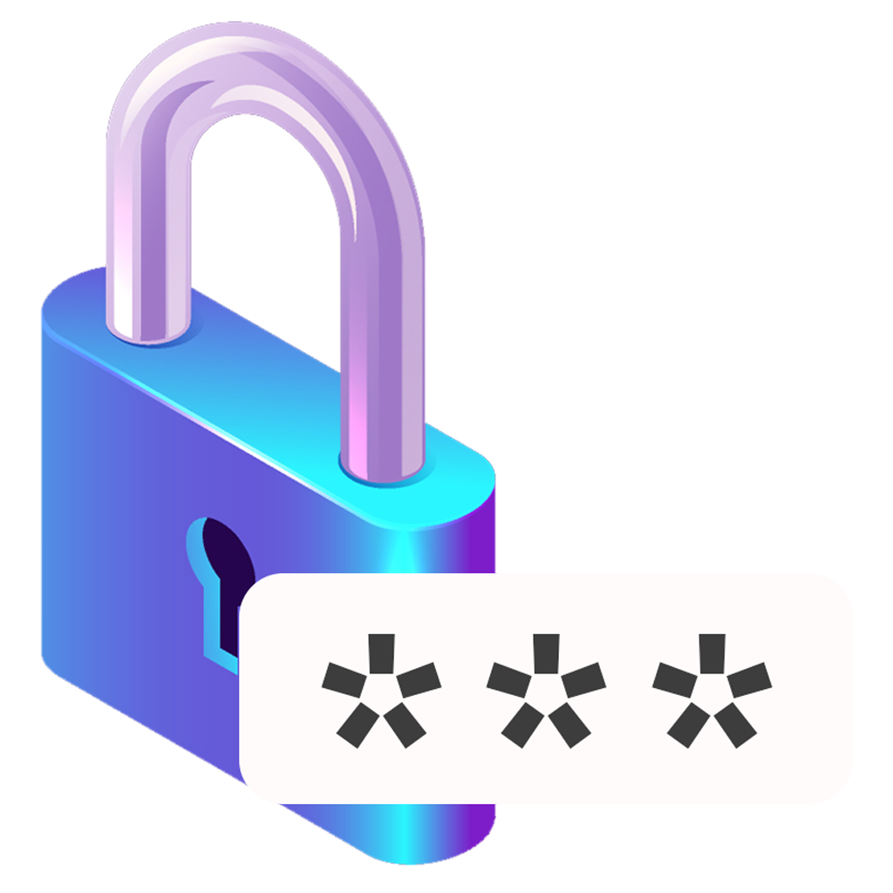
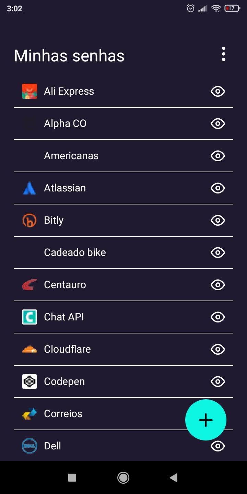

<p align="center">
  
</p>

<h1 align="center">My pass</h1>
<p align="center">A small webcam player focused on providing an easy way to add and control your webcam during recordings.</p>


## Preview

Sample preview running the app:

<div style="display: flex; gap: 0 10px">
  
  
  
</div>

<br/>

# Usage

<ul>
  <li>Add some passwords on the app.</li>
  <li>The storage is local only.</li>
  <li>You may remove passwords any time.</li>
</ul>

## Resources

<table>
  <thead>
    <tr>
      <th>Resource</th>
      <th>Why?</th>
    </tr>
  </thead>
  <tbody>
    <tr>
      <td>Store access data for an app</td>
      <td>Click in the (+) float action button.</td>
    </tr>
    <tr>
      <td>Toggle the fingerprint protection for each password</td>
      <td>Click on <svg width="24" height="24" xmlns="http://www.w3.org/2000/svg" fill="#FFF"><path d="M12 16c1.656 0 3 1.344 3 3s-1.344 3-3 3-3-1.344-3-3 1.344-3 3-3zm0 1c1.104 0 2 .896 2 2s-.896 2-2 2-2-.896-2-2 .896-2 2-2zm0-8c1.656 0 3 1.344 3 3s-1.344 3-3 3-3-1.344-3-3 1.344-3 3-3zm0 1c1.104 0 2 .896 2 2s-.896 2-2 2-2-.896-2-2 .896-2 2-2zm0-8c1.656 0 3 1.344 3 3s-1.344 3-3 3-3-1.344-3-3 1.344-3 3-3zm0 1c1.104 0 2 .896 2 2s-.896 2-2 2-2-.896-2-2 .896-2 2-2z"/></svg> icon and toggle the "Protect passwords with fingerprint." state.</td>
    </tr>
    <tr>
      <td>Remove all stored passwords</td>
      <td>Click on <svg width="24" height="24" xmlns="http://www.w3.org/2000/svg" fill="#FFF"><path d="M12 16c1.656 0 3 1.344 3 3s-1.344 3-3 3-3-1.344-3-3 1.344-3 3-3zm0 1c1.104 0 2 .896 2 2s-.896 2-2 2-2-.896-2-2 .896-2 2-2zm0-8c1.656 0 3 1.344 3 3s-1.344 3-3 3-3-1.344-3-3 1.344-3 3-3zm0 1c1.104 0 2 .896 2 2s-.896 2-2 2-2-.896-2-2 .896-2 2-2zm0-8c1.656 0 3 1.344 3 3s-1.344 3-3 3-3-1.344-3-3 1.344-3 3-3zm0 1c1.104 0 2 .896 2 2s-.896 2-2 2-2-.896-2-2 .896-2 2-2z"/></svg> icon and chose "Remove all passwords", then confirm this.</td>
    </tr>
    <tr>
      <td>Remove a specific password</td>
      <td>Make a long press in the item you want to remove. A trash icon will appear on the right. Then click on it.</td>
    </tr>
  </tbody>
</table>

# Contributing

Clone the repository

```sh
git clone https://github.com/felipeleite11/my-pass
```

Open its folder and install dependencies with:

```sh
yarn
```

Run it using:

```sh
yarn start
```

# Author

👤 **Felipe Leite**

- Github: [felipeleite11](https://github.com/felipeleite11)
